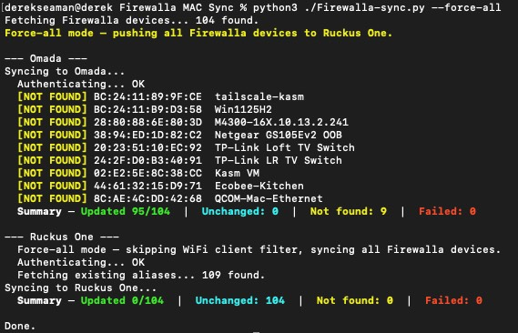

# Firewalla to Omada + Ruckus One Device Name Sync

Syncs device names from the [Firewalla](https://firewalla.com/) MSP cloud API
to network management platforms. When run, the script fetches all known devices
from Firewalla and pushes each device's name to every configured platform using
the device's MAC address as the lookup key.

Devices without a name or with an invalid MAC address are automatically skipped.
On subsequent runs, devices whose name already matches are skipped entirely
(no unnecessary API calls).

## Supported Platforms

| Platform | Method | Notes |
| --- | --- | --- |
| **TP-Link Omada** | REST API | Local controller access required; firmware 5.1+ |
| **Ruckus One** | REST API | Cloud-based; reachable from anywhere (see note below) |

> **Ruckus One note:** The Ruckus One APIs support setting and reading client
> device aliases. However, they are not currently visible in the Ruckus One
> web UI. It is expected that in April 2026 the web UI will support the
> display of client device aliases.

The script is designed to make adding new platforms straightforward — see
[Adding a New Platform](#adding-a-new-platform) below.

## How It Works

1. Reads credentials from `secrets.conf`
2. Fetches the full device list from the Firewalla MSP API
3. Filters out entries with invalid/missing MAC addresses or empty names
4. For each selected platform:
   - Pushes updated names and prints a per-platform summary
   - **Omada:** authenticates directly to the controller REST API and
     pushes all device names on every run
   - **Ruckus One:** fetches known WiFi client MACs and current aliases
     first, then only pushes names that have changed — devices not
     recognized by Ruckus are reported as "not found" without making
     an API call. Use `--force-all` to push every Firewalla device
     regardless of whether Ruckus has seen it before

## Requirements

- **Python 3.8+**
- **[`requests`](https://pypi.org/project/requests/)** — HTTP client (the only dependency)

```bash
pip install requests
```

No additional tools or CLI utilities are required. Both platforms are accessed
via direct REST API calls.

## Configuration

Copy `secrets.conf.example` to `secrets.conf` and fill in your values:

```bash
cp secrets.conf.example secrets.conf
chmod 600 secrets.conf
```

`secrets.conf` contains API tokens and client secrets. Restrict its
permissions to owner-only (`600`) and ensure it is listed in `.gitignore`
to prevent accidental commits.

```ini
[DEFAULT]
FIREWALLA_API_TOKEN=your_token_here
FIREWALLA_MSP_ID=your-msp-id

# Omada SDN controller — only required when using --platform omada
OMADA_URL=https://192.168.1.1:8043
OMADA_USERNAME=your_omada_username
OMADA_PASSWORD=your_omada_password
OMADA_SITE=Default
OMADA_VERIFY_SSL=true

# Ruckus One — only required when using --platform ruckus
RUCKUS_CLIENT_ID=your_client_id_here
RUCKUS_CLIENT_SECRET=your_client_secret_here
RUCKUS_TENANT_ID=your_32_char_tenant_id_here
RUCKUS_REGION=us
```

### Where to find each value

| Key | Where to find it |
| --- | --- |
| `FIREWALLA_API_TOKEN` | Firewalla MSP portal → Account → API Settings → Create Token |
| `FIREWALLA_MSP_ID` | The subdomain of your MSP portal URL. If your portal is at `https://abc-xyz123.firewalla.net`, the MSP ID is `abc-xyz123`. |
| `OMADA_URL` | The full URL of your Omada controller, including port. Software controller default: `https://<host>:8043`. Hardware controller default: `https://<host>:443`. |
| `OMADA_USERNAME` | An Omada admin account username |
| `OMADA_PASSWORD` | Password for the Omada admin account |
| `OMADA_SITE` | The site name as shown in the Omada controller UI (default: `Default`) |
| `OMADA_VERIFY_SSL` | Set to `false` only if your controller uses a self-signed certificate |
| `RUCKUS_CLIENT_ID` | Ruckus One portal → Administration → Account Management → Settings → Application Tokens |
| `RUCKUS_CLIENT_SECRET` | Same location as Client ID |
| `RUCKUS_TENANT_ID` | The 32-character hex string in the Ruckus One portal URL: `https://ruckus.cloud/{tenant_id}/t/dashboard` |
| `RUCKUS_REGION` | `us`, `eu`, or `asia` — matches the region of your Ruckus One account |

## Usage

```bash
# Sync to all configured platforms (default)
python Firewalla-sync.py

# Sync to a specific platform only
python Firewalla-sync.py --platform omada
python Firewalla-sync.py --platform ruckus

# Sync to multiple specific platforms
python Firewalla-sync.py --platform omada ruckus

# Preview what would change without pushing anything
python Firewalla-sync.py --dry-run
python Firewalla-sync.py --platform ruckus --dry-run

# Suppress per-device NOT FOUND lines (show summaries only)
python Firewalla-sync.py --quiet

# Push all Firewalla devices to Ruckus One, even if unseen by Ruckus (Ruckus only)
python Firewalla-sync.py --platform ruckus --force-all

# Preview force-all changes without pushing anything
python Firewalla-sync.py --platform ruckus --force-all --dry-run
```

### Example Output



### Summary Fields

| Field | Meaning |
| --- | --- |
| **Updated** | Name was successfully pushed to the platform |
| **Unchanged** | Name already matched — no API call was made |
| **Not found** | Device exists in Firewalla but is unknown to this platform (e.g. a wired-only device on a WiFi-only controller) |
| **Failed** | Push was attempted but the platform returned an error |

## Adding a New Platform

The script uses a `Platform` abstract base class so new integrations can be
added without modifying the sync engine. A minimal platform needs only
**~20 lines of code** and **4 touch points**:

### 1. Create the class

```python
class UniFiPlatform(Platform):
    """Ubiquiti UniFi controller via REST API."""

    @property
    def platform_name(self) -> str:
        return 'UniFi'

    def set_device_name(self, mac: str, name: str) -> str:
        # mac is lowercase colon-separated, name is already sanitized
        ...
        return 'updated'   # or 'not_found' or 'failed'
```

### 2. Register it

```python
# In PLATFORM_REGISTRY at the bottom of the file:
PLATFORM_REGISTRY: dict[str, type[Platform]] = {
    'omada':  OmadaPlatform,
    'ruckus': RuckusPlatform,
    'unifi':  UniFiPlatform,      # add this
}
```

### 3. Declare required config keys

```python
PLATFORM_REQUIRED_KEYS: dict[str, list[str]] = {
    'omada': [],
    'ruckus': ['RUCKUS_CLIENT_ID', ...],
    'unifi':  ['UNIFI_HOST', 'UNIFI_USERNAME', 'UNIFI_PASSWORD'],  # add this
}
```

### 4. Add keys to `secrets.conf.example`

That's it. The argparse `--platform` choices, config validation, sync loop,
dry-run support, and summary output are all handled automatically.

### Optional overrides

| Method | Default | Override when... |
| --- | --- | --- |
| `sanitize_name(name)` | Returns name unchanged | The platform has naming restrictions (e.g. no spaces, max length) |
| `fetch_known_macs()` | `None` (sync all) | You want to limit syncing to MACs the platform already knows about |
| `fetch_existing_names()` | `{}` (always push) | The platform's API lets you read current names for skip-if-unchanged |

See the module docstring at the top of `Firewalla-sync.py` for the full
step-by-step guide.

## Platform-Specific Behavior

### Omada

- Authenticates directly to the Omada controller REST API (firmware 5.1+ required);
  no third-party CLI or tools are needed
- Login is a three-step sequence: fetch controller ID → obtain CSRF token →
  resolve site name to site ID. The session is cached for the duration of the run
- MACs are converted from colon-separated (`aa:bb:cc:dd:ee:ff`) to
  hyphen-separated (`aa-bb-cc-dd-ee-ff`) as required by the Omada API
- Leading hyphens are stripped from device names (the Omada API treats them as invalid)
- No unchanged detection — every run pushes all device names to the controller
- All HTTP requests have a 10-second timeout with one automatic retry on
  transient connection errors
- Set `OMADA_VERIFY_SSL=false` when the controller uses a self-signed TLS certificate
  (common for software controllers on a LAN); doing so suppresses urllib3 warnings

### Ruckus One

- Alias names are sanitized: spaces become hyphens, characters outside
  `[a-zA-Z0-9_-]` are stripped, consecutive hyphens are collapsed,
  leading/trailing hyphens and underscores are trimmed, max 255 characters
- By default, only WiFi clients that have connected to a Ruckus AP are synced —
  wired-only devices and devices Ruckus has never seen are reported as "not found"
- `--force-all` skips the WiFi client MAC lookup and attempts to push every
  Firewalla device; skip-if-unchanged still applies, so already-correct aliases
  are not re-pushed
- Uses a persistent HTTP session with connection pooling for performance
  across many sequential API calls
- OAuth2 JWT token is cached for the duration of the run
- `RUCKUS_REGION` must be exactly `us`, `eu`, or `asia` — any other value
  is rejected at startup with a clear error message
- `RUCKUS_TENANT_ID` must be a 32-character hexadecimal string — validated
  at startup to catch typos before any network calls are made

## Scheduling (cron)

To sync automatically every hour, add a crontab entry:

```bash
crontab -e
```

```cron
0 * * * * cd /path/to/firewalla-mac-sync && python Firewalla-sync.py --quiet >> /var/log/firewalla-sync.log 2>&1
```

`--quiet` suppresses the per-device NOT FOUND lines that would otherwise
fill the log on every run. Normal output goes to stdout; error messages
go to stderr — both are captured by `2>&1`.

## Troubleshooting

| Symptom | Likely cause | Fix |
| --- | --- | --- |
| `Config file 'secrets.conf' not found` | File doesn't exist | `cp secrets.conf.example secrets.conf` and fill in values |
| `secrets.conf is missing a [DEFAULT] section header` | File exists but has no section header | Add `[DEFAULT]` as the very first line of `secrets.conf` |
| `FIREWALLA_MSP_ID contains invalid characters` | Wrong value copied | Use only the subdomain, e.g. `abc-xyz123` not the full URL |
| `RUCKUS_REGION 'X' is invalid` | Typo in config | Must be exactly `us`, `eu`, or `asia` |
| `RUCKUS_TENANT_ID must be a 32-character hex string` | Wrong value copied | Copy the hex string from your portal URL, not the full URL |
| `Auth redirected` | Wrong client ID or secret | Regenerate an Application Token in the Ruckus One portal |
| `No access_token in response` | Token expired or revoked | Regenerate credentials in the Ruckus One portal |
| All devices `[NOT FOUND]` on Omada | Controller unreachable or wrong site name | Verify `OMADA_URL` is reachable and `OMADA_SITE` matches a site in the controller UI |
| `Omada login failed (code …)` | Wrong username or password | Check `OMADA_USERNAME` / `OMADA_PASSWORD` in `secrets.conf` |
| SSL certificate error on Omada | Self-signed controller certificate | Set `OMADA_VERIFY_SSL=false` in `secrets.conf` |

## Notes

- ANSI color output is automatically disabled when stdout is not a TTY
  (e.g. piped to a file, running in cron)
- Error messages are written to stderr; normal progress output goes to stdout
- The Firewalla MSP ID is validated to contain only letters, numbers, and
  hyphens before being used in URL construction
- Devices without a name in Firewalla are silently skipped (no empty names
  are pushed)
- All HTTP requests have a 10-second timeout with one automatic retry on
  transient connection errors
- The script exits immediately on authentication or API errors with a
  descriptive message

### Exit codes

| Code | Meaning |
| --- | --- |
| `0` | Success |
| `1` | Configuration error (missing or invalid config value) |
| `2` | Authentication failure |
| `3` | Network or API error |

## Linting

This project uses [ruff](https://docs.astral.sh/ruff/) for Python and
[markdownlint-cli2](https://github.com/DavidAnson/markdownlint-cli2) for
Markdown:

```bash
pip install ruff
ruff check Firewalla-sync.py
markdownlint-cli2 "*.md"
```

Configuration is in `pyproject.toml` and `.markdownlint-cli2.yaml`.
